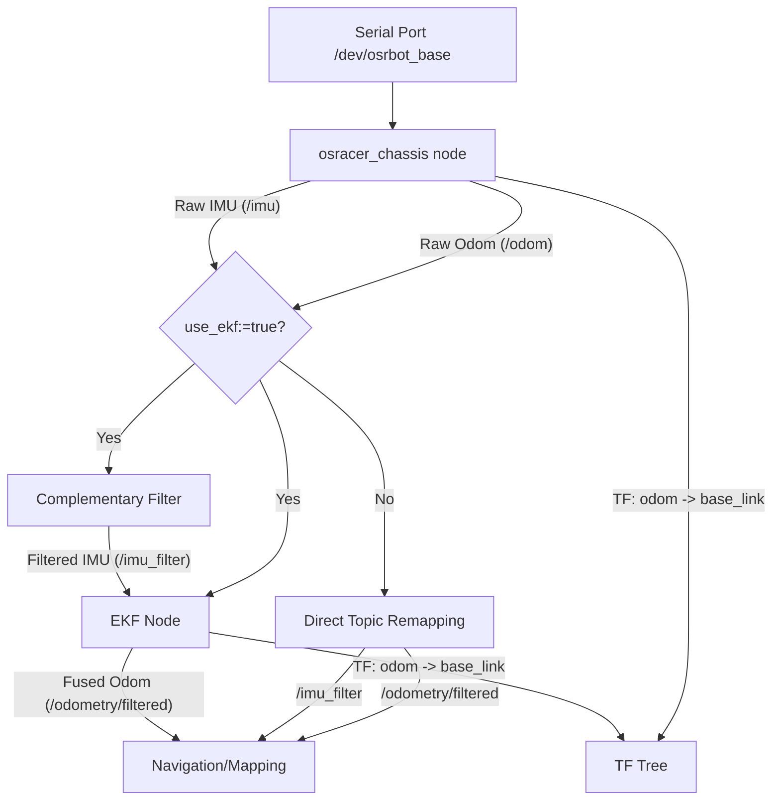

# OSRacer - Autonomous Racing Car

## 1. Installation & Setup

### 1.1 System Requirements
- **OS**: Ubuntu 22.04 (Jammy Jellyfish)
- **ROS Version**: [ROS 2 Humble](https://docs.ros.org/en/humble/Installation/Ubuntu-Install-Debs.html)

### 1.2 Install ROS 2 Humble
If you haven't installed ROS 2 Humble yet, follow these steps:

```bash
# Set locale
locale  # check for UTF-8
sudo apt update && sudo apt install locales
sudo locale-gen en_US en_US.UTF-8
sudo update-locale LC_ALL=en_US.UTF-8 LANG=en_US.UTF-8
export LANG=en_US.UTF-8

# Add ROS 2 repository
sudo apt install software-properties-common
sudo add-apt-repository universe
sudo apt update && sudo apt install curl -y
sudo curl -sSL https://raw.githubusercontent.com/ros/rosdistro/master/ros.key -o /usr/share/keyrings/ros-archive-keyring.gpg
echo "deb [arch=$(dpkg --print-architecture) signed-by=/usr/share/keyrings/ros-archive-keyring.gpg] http://mirrors.ustc.edu.cn/ros2/ubuntu $(lsb_release -sc) main" | sudo tee /etc/apt/sources.list.d/ros2.list > /dev/null

# Install ROS 2 packages
sudo apt update
sudo apt upgrade
sudo apt install ros-humble-desktop-full
sudo apt autoremove
sudo apt install ros-dev-tools

# Source setup script
echo "source /opt/ros/humble/setup.bash" >>  ~/.bashrc
source ~/.bashrc
```

### 1.3 Install Dependencies
Install necessary ROS 2 packages and tools:

```bash
sudo apt install python3-pip
sudo apt install ros-humble-nav2-bringup \
                 ros-humble-libg2o \
                 ros-humble-imu-tools \
                 ros-humble-robot-localization \
                 ros-humble-joint-state-publisher \
                 ros-humble-joint-state-publisher-gui \
                 ros-humble-usb-cam \
                 ros-humble-cartographer-ros \
                 ros-humble-cartographer-rviz \
                 ros-humble-rqt-tf-tree \
                 ros-humble-ackermann-msgs -y
```

### 1.4 Serial Driver Installation
Install serial communication libraries and drivers:

```bash
# CppLinuxSerial (for serial communication)
git clone https://github.com/gbmhunter/CppLinuxSerial.git
cd CppLinuxSerial
mkdir build && cd build
cmake .. && make
sudo make install

# Serial ROS2 wrapper
git clone https://github.com/RoverRobotics-forks/serial-ros2.git
cd serial-ros2
mkdir build && cd build
cmake .. && make
sudo make install

# Remove conflicting brltty (if present)
sudo apt remove brltty
```

### 1.5 UDEV Rules Setup
Configure permissions for serial devices:

```bash
sudo usermod -aG dialout $USER
sudo udevadm control --reload-rules
sudo service udev restart
sudo udevadm trigger
```

### 1.6 Update Source Code With Git

```bash
cd ~/your_worksapce/src/osracer && git add . && git stash && git pull --recurse-submodules

# git clone --recursive https://github.com/osrbot/osracer.git
```
---

## 2. Quick Start (Bringup)

Launch the complete robot system (Chassis, Sensors, TF):

```bash
ros2 launch osracer_bringup bringup.launch.py
```

---

## 3. Hardware Modules

### 3.1 Chassis Control
Launch the Ackermann chassis driver. You can choose between raw odometry or EKF-fused odometry (IMU + Encoders).

**Architecture Overview:**


**Usage Options:**

1. **Standard Mode (Default):** Use internal encoder-based odometry.
   ```bash
   ros2 launch osracer_bringup chassis_ackermann.launch.py
   ```

2. **EKF Mode (Recommended for SLAM):** Use EKF to fuse IMU and encoders for better position estimation.
   ```bash
   ros2 launch osracer_bringup chassis_ackermann.launch.py use_ekf:=true
   ```

| Parameter | Default | Description |
|-----------|---------|-------------|
| `use_ekf` | `false` | Enable/Disable Robot Localization (EKF) |
| `publish_tf` | `auto` | Auto-set to `true` if EKF is off, `false` if EKF is on |
| `port_name` | `/dev/osrbot_base` | Serial device port |
| `wheelbase` | `0.285` | Distance between front and rear axles (m) |

### 3.2 Sensors
**Lidar:**
```bash
ros2 launch osracer_bringup lidar.launch.py
```

**USB Camera:**
```bash
ros2 launch osracer_bringup usb_cam.launch.py
```

#### Camera Intrinsic Calibration with Calibration Plate 8*6

```bash
ros2 run camera_calibration cameracalibrator --size 8x6 --square 0.03 image:=/rgb/image_raw camera:=/rgb
```

### 3.3 Debugging & Visualization
View sensor data individually:

```bash
# Odometry
ros2 launch osracer_debug debug_odom.launch.py

# Lidar
ros2 launch osracer_debug debug_lidar.launch.py 

# IMU
ros2 launch osracer_debug debug_imu.launch.py 

# Camera Image
ros2 launch osracer_debug debug_image.launch.py
```

---

## 4. SLAM & Mapping

### 4.1 GMapping
Launch GMapping SLAM:
```bash
ros2 launch osracer_slam gmapping.launch.py
```
Visualize GMapping:
```bash
ros2 launch osracer_debug debug_mapping.launch.py 
```

### 4.2 Cartographer
Launch Cartographer SLAM:
```bash
ros2 launch osracer_slam cartographer.launch.py
```
Visualize Cartographer:
```bash
ros2 launch osracer_debug debug_cartographer.launch.py 
```

### 4.3 Save Map
Save the generated map to disk:

**For GMapping / Default:**
```bash
ros2 launch osracer_slam map_save.launch.xml
```

**For Cartographer:**
```bash
ros2 launch osracer_slam map_save_cartographer.launch.xml
```

---

## 5. Navigation

### 5.1 Navigation with SLAM (Recommended)
Launch navigation while building a map simultaneously. Default planner: **TEB** (optimized for Ackermann steering).
```bash
ros2 launch osracer_navigation bringup_launch.py slam:=True
```

### 5.2 Navigation with Existing Map
Navigate within a pre-built map using localization (AMCL).
```bash
ros2 launch osracer_navigation bringup_launch.py map:=/path/to/your/map.yaml
```
Or use the default map:
```bash
ros2 launch osracer_navigation bringup_launch.py
```

### 5.3 Switch Local Planner
**Use DWB Planner:**
```bash
ros2 launch osracer_navigation bringup_launch.py slam:=True planner:=dwb
```

**Use TEB Planner (Default):**
```bash
ros2 launch osracer_navigation bringup_launch.py slam:=True planner:=teb
```

**Use Custom Parameter File:**
```bash
ros2 launch osracer_navigation bringup_launch.py slam:=True params_file:=/path/to/custom_params.yaml
```

> **Note:** TEB is recommended for Ackermann vehicles due to its kinematic constraint support (`min_turning_radius`, `wheelbase`).

---

## 6. Authors

- **Zhihao ZHANG** - [zhangzhihao0618@gmail.com](mailto:zhangzhihao0618@gmail.com)
- **Kit So**
- **Jintai WANG**

## 7. License

This project is licensed under the MIT License - see the [LICENSE](LICENSE) file for details.
