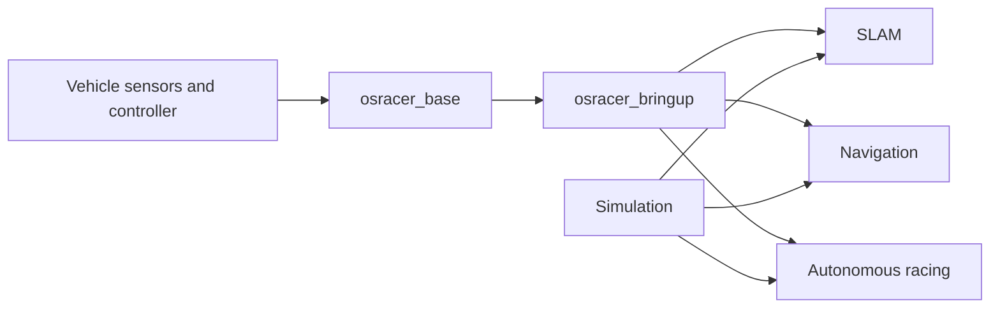

# OSRacer

<!-- markdownlint-disable MD013 MD033 -->

<p align="center">
  <a href="./README.md">English</a> ·
  <a href="./README_zh.md">简体中文</a>
</p>

<p align="center">
  
</p>

<p align="center">
  <strong>Open-source ROS 2 software for autonomous racing and mobile robot development.</strong>
</p>

<p align="center">
  <a href="https://github.com/osrbot/osracer/actions/workflows/ros2-static.yml"></a>
  <a href="https://github.com/osrbot/osracer/releases"></a>
  <a href="https://docs.ros.org/en/humble/"></a>
  <a href="https://ubuntu.com/"></a>
  <a href="./LICENSE"></a>
</p>

OSRacer is OSRBOT's ROS 2 platform for vehicle bringup, perception, mapping,
navigation, autonomous racing, simulation, calibration, and diagnostics. It
provides a coherent development workspace for moving from a first real-vehicle
connection to repeatable autonomy experiments.

## Highlights

- **Ackermann-native control** — velocity and steering interfaces designed for
  compact autonomous vehicles.
- **Integrated robot runtime** — chassis, odometry, inertial sensing, LiDAR,
  camera, TF, and state estimation in one bringup path.
- **Mapping and navigation** — maintained launch files and reference
  configurations for SLAM and Nav2.
- **Autonomous racing** — gap following, Pure Pursuit, Stanley, MPC, raceline
  tracking, safety supervision, and evaluation tools.
- **Simulation-ready workflows** — lightweight kinematic simulation and Gazebo
  scenarios that use the same ROS interfaces as the vehicle.
- **Built for secondary development** — package-level configuration,
  calibration examples, debugging tools, and reproducible source dependencies.

## Current Version

**OSRacer V1.3** is the current ROS 2 platform version. It provides:

- a unified ROS 2 chassis integration through the pinned OSRacer Base release;
- complete bringup, TF, odometry, IMU, LiDAR, camera, and state-estimation paths;
- maintained SLAM, Nav2, autonomous-racing, simulation, calibration, and
  diagnostic workflows;
- an odometry-directed navigation recovery behavior with costmap clearing;
- automatic chassis capability adaptation with independent racing and simulation models;
- workspace CI covering source dependencies, ROS build, package tests, and
  installed launch startup.

See the [changelog](CHANGELOG.md) for compatibility and upgrade information.

## Quick Start

### Requirements

- Ubuntu 22.04
- ROS 2 Humble
- Git, `vcs`, `rosdep`, and `colcon`
- Access to an OSRacer system for real-vehicle operation

Install the ROS development tools if they are not already available:

```bash
sudo apt update
sudo apt install python3-colcon-common-extensions python3-rosdep python3-vcstool
```

### Create the workspace

```bash
mkdir -p ~/osracer_ws/src
cd ~/osracer_ws/src

git clone --recursive https://github.com/osrbot/osracer.git
vcs import . < osracer/osracer.repos

source /opt/ros/humble/setup.bash
rosdep install --from-paths . --ignore-src --rosdistro humble -r -y

cd ~/osracer_ws
colcon build --symlink-install
source install/setup.bash
```

The repository pins its source dependencies. Keep the imported
`osracer_base` revision and the `osracer_dependency` submodule unchanged unless
you are deliberately updating the complete workspace.

### Prepare the serial device

```bash
ros2 run osracer_base install_udev_rules
```

Reconnect the USB cable after installing the rule. Log out and back in if your
user was newly added to the `dialout` group.

### Start the vehicle

```bash
source /opt/ros/humble/setup.bash
source ~/osracer_ws/install/setup.bash
ros2 launch osracer_bringup bringup.launch.py
```

For the first motion test, raise the driven wheels clear of the floor and keep
an emergency stop within reach.

### Start a workflow

Run these commands in separate terminals after vehicle bringup:

```bash
# SLAM Toolbox
ros2 launch osracer_slam slam_toolbox.launch.py

# Navigation with the saved map and default controller
ros2 launch osracer_navigation nav2.launch.py
```

## Software Architecture



`osracer_base` provides the chassis interface. This repository adds product
bringup and higher-level ROS applications. Simulation follows the same command,
odometry, scan, and TF conventions used by the vehicle.

## Packages

| Package | Purpose |
| --- | --- |
| `osracer_bringup` | Vehicle, sensor, state-estimation, camera, LiDAR, and accessory startup |
| `osracer_description` | Robot description, meshes, TF, and RViz resources |
| `osracer_slam` | SLAM Toolbox, Cartographer, GMapping, and map utilities |
| `osracer_navigation` | Nav2 launch files and reference controller configurations |
| `osracer_race` | Racing controllers, safety supervision, raceline tools, and evaluation |
| `osracer_sim` | Kinematic and Gazebo simulation workflows |
| `osracer_calib` | Camera and magnetometer calibration examples |
| `osracer_debug` | RViz and rqt diagnostics for sensors, odometry, mapping, and navigation |
| `osracer_demo` | Field bringup and low-speed demonstration tools |

Advanced policy development, Isaac workflows, and Sim2Real research are
maintained in [OSRacer Lab](https://github.com/osrbot/osracer_lab).

### Autonomous Racing

**Recommended first run sequence:** validate the vehicle with
`race_safe.yaml`, begin with Gap Follow, record a low-speed raceline, compare
the path-tracking controllers, and use `race_fast.yaml` only after the complete
safety checklist passes.

- [Racing guide](osracer_race/README_zh.md)
- [Four-stage development guide](osracer_race/PHASES_zh.md)
- [ROS and vehicle validation](osracer_race/ROS_VALIDATION_zh.md)

The installed validation entry does not publish a motion command:

```bash
bash $(ros2 pkg prefix osracer_race)/share/osracer_race/scripts/validate_race_ros.sh
```

### Development and Runtime Split

Run the vehicle, sensor, SLAM, navigation, and racing nodes on the Jetson Orin Nano.
Use a development computer for source editing, remote terminals, RViz,
rosbag analysis, and preparing maps or racelines. Validate all motion-related
changes on the vehicle with the low-speed safety configuration first.

## Dependencies

| Dependency | How it is provided | Purpose |
| --- | --- | --- |
| [`osracer_base`](https://github.com/osrbot/osracer_base) | Exact revision in [`osracer.repos`](osracer.repos) | ROS 2 chassis driver and vehicle interface |
| [`osracer_dependency`](https://github.com/osrbot/osrbot_dependency) | Pinned Git submodule | OSRBOT-maintained ROS dependencies |
| ROS packages | `package.xml` and `rosdep` | Standard ROS messages, drivers, SLAM, navigation, and visualization |

If a package is missing after cloning, restore the declared source dependencies:

```bash
cd ~/osracer_ws/src/osracer
git submodule update --init --recursive

cd ~/osracer_ws/src
vcs import . < osracer/osracer.repos
```

## Configuration

The main user-editable configuration is organized by function:

| Area | Location |
| --- | --- |
| Controller geometry and operating limits | Read automatically by `osracer_base` from a compatible controller |
| Bringup and state estimation | `osracer_bringup/param/` |
| SLAM | `osracer_slam/param/` |
| Navigation | `osracer_navigation/params/` |
| Racing model, strategies, and racelines | `osracer_race/config/` |
| Simulation model and worlds | `osracer_sim` launch arguments and `osracer_sim/worlds/` |
| Calibration | `osracer_calib/config/` |

On a vehicle, the chassis driver reads geometry and operating limits from the
controller when the serial link is established. Racing configuration remains
an upper-layer algorithm model, while simulation uses explicit launch model
arguments and does not require a controller. Robot description and sensor TF
remain product-integration configuration.

Keep configuration changes small and validate steering, stopping, TF, odometry,
and sensor topics before enabling autonomous operation.

## Firmware Updates

Firmware service is independent of the ROS workspace. Use
[OSR Updater](https://github.com/osrbot/osr_updater) with the firmware file
supplied by OSRBOT for your system. Do not substitute a firmware file from
another delivery or an unknown source.

## Troubleshooting

| Symptom | Recommended action |
| --- | --- |
| `/dev/osrbot_base` is missing | Reinstall the Base udev rule, reconnect USB, and verify `dialout` membership. |
| A ROS package cannot be found | Initialize the submodule, import `osracer.repos`, run `rosdep`, rebuild, and source the workspace. |
| The serial port is busy | Stop other ROS nodes or utilities that have opened the chassis device, then relaunch bringup. |
| Sensor topics are not updating | Check the physical connection and inspect topic rate with `ros2 topic hz <topic>`. |
| Navigation cannot start | Verify the map path and the `map → odom → base_footprint` TF chain, then check the scan topic. |
| A firmware update fails | Stop vehicle motion, keep the update log and backup file, and contact OSRBOT before retrying an uncertain transfer. |

When requesting support, include the repository commit, ROS distribution,
Jetson/Linux version, launch command, and the relevant terminal output.

## Releases and Support

- [Release notes](CHANGELOG.md)
- [GitHub Releases](https://github.com/osrbot/osracer/releases)
- [GitHub Issues](https://github.com/osrbot/osracer/issues)
- Technical support and collaboration: [winter@osrbot.com](mailto:winter@osrbot.com)

## Authors

- Zhihao ZHANG
- Kit So
- Jintai WANG
- dajianli

## License

OSRacer is released under the [MIT License](LICENSE).
