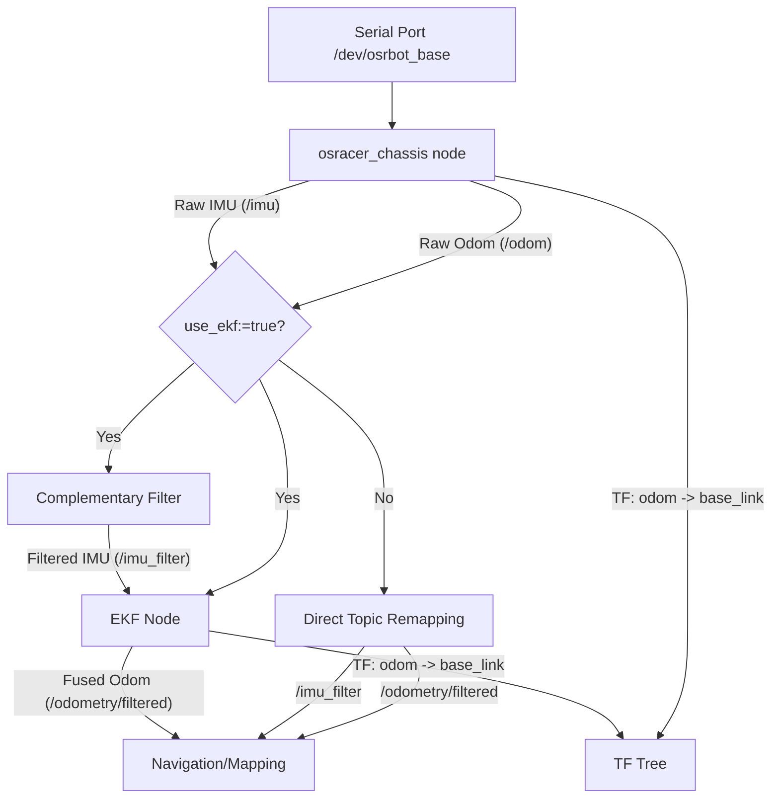

# OSRacer - Autonomous Racing Car

This repository is the ROS 2 runtime workspace for OSRacer vehicles. Delivered
robots run it on the onboard Jetson Orin Nano with JetPack 6.x, Ubuntu 22.04,
and ROS 2 Humble. The installation steps below are for rebuilding the robot
workspace or preparing another ROS 2 Humble machine; normal field use starts
from the launch and demo commands after the vehicle has been deployed.

## 1. Installation & Setup

<details>
<summary>Click to expand</summary>

### 1.1 System Requirements
- **OS**: Ubuntu 22.04 (Jammy Jellyfish)
- **ROS Version**: [ROS 2 Humble](https://docs.ros.org/en/humble/Installation/Ubuntu-Install-Debs.html)

### 1.2 Install ROS 2 Humble
If you haven't installed ROS 2 Humble yet, follow these steps:

```bash
# Set locale
locale  # check for UTF-8
sudo apt update && sudo apt install locales
sudo locale-gen en_US en_US.UTF-8
sudo update-locale LC_ALL=en_US.UTF-8 LANG=en_US.UTF-8
export LANG=en_US.UTF-8

# Add ROS 2 repository
sudo apt install software-properties-common
sudo add-apt-repository universe
sudo apt update && sudo apt install curl -y
sudo curl -sSL https://raw.githubusercontent.com/ros/rosdistro/master/ros.key -o /usr/share/keyrings/ros-archive-keyring.gpg
echo "deb [arch=$(dpkg --print-architecture) signed-by=/usr/share/keyrings/ros-archive-keyring.gpg] http://mirrors.ustc.edu.cn/ros2/ubuntu $(lsb_release -sc) main" | sudo tee /etc/apt/sources.list.d/ros2.list > /dev/null

# Install ROS 2 packages
sudo apt update
sudo apt upgrade
sudo apt install ros-humble-desktop-full
sudo apt autoremove
sudo apt install ros-dev-tools

# Source setup script
echo "source /opt/ros/humble/setup.bash" >>  ~/.bashrc
source ~/.bashrc
```

### 1.3 Install Dependencies
Install necessary ROS 2 packages and tools:

```bash
sudo apt install python3-pip python3-serial python3-tk python3-vcstool libsuitesparse-dev
sudo apt install ros-humble-nav2-bringup \
                 ros-humble-libg2o \
                 ros-humble-imu-tools \
                 ros-humble-robot-localization \
                 ros-humble-joint-state-publisher \
                 ros-humble-joint-state-publisher-gui \
                 ros-humble-usb-cam \
                 ros-humble-cartographer-ros \
                 ros-humble-cartographer-rviz \
                 ros-humble-cv-bridge \
                 ros-humble-rqt-tf-tree \
                 ros-humble-tf-transformations \
                 ros-humble-ros-gz-bridge \
                 ros-humble-ros-gz-sim \
                 ros-humble-ackermann-msgs -y
```

### 1.4 Serial Device Setup
The chassis driver uses Python serial and the stable udev device
`/dev/osrbot_base`. Configure serial permissions and install the packaged udev
rules on the robot computer:

```bash
sudo usermod -aG dialout $USER
sudo apt remove brltty
sudo bash osracer_bringup/script/udev/install_udev.sh
sudo udevadm control --reload-rules
sudo udevadm trigger
```

Log out and back in after adding the user to `dialout`.

### 1.5 Update Source Code With Git

```bash
cd ~/your_workspace/src/osracer && git add . && git stash && git pull --recurse-submodules

# git clone --recursive https://github.com/osrbot/osracer.git
```

`osracer_dependency` is a pinned submodule for OSR-controlled third-party ROS 2
dependencies, including Lakibeam lidar, gmapping, camera calibration, and TEB
related packages. It is part of the reproducible deployment surface, not an
empty folder to remove. If it is missing after cloning, run:

```bash
git submodule update --init --recursive
```

The chassis runtime is maintained separately and pinned by `osracer.repos` to
the annotated `osracer_base` tag `v0.1.0` (commit
`c7ba366084a56de32cb994048edd1e633090b69e`). Import it beside this repository
before building the workspace:

```bash
cd ~/your_workspace/src
vcs import . < osracer/osracer.repos
test "$(git -C osracer_base rev-parse HEAD)" = \
  "c7ba366084a56de32cb994048edd1e633090b69e"
```

The VCS dependency is source-only at build time; no `osracer_base` business
code is copied into this repository.

---

</details>

## 2. Quick Start (Bringup)

Launch the complete robot system (Chassis, Sensors, TF):

```bash
ros2 launch osracer_bringup bringup.launch.py
```

---

## 2.1 Development and Runtime Split

The robot computer is the Jetson Orin Nano running JetPack 6.x and ROS 2 Humble.
Use it for hardware bringup, LiDAR/camera/serial access, SLAM, navigation, and
real-car race tests.

A separate development computer can be used for editing code, visualizing RViz,
recording bags, and preparing maps or race lines. It should connect to the robot
over the same ROS 2 network, but hardware drivers and final motion tests should
run on the Jetson.

---

## 3. Hardware Modules

<details>
<summary>Click to expand</summary>

### 3.1 Chassis Control
Launch the Ackermann chassis driver. You can choose between raw odometry or EKF-fused odometry (IMU + Encoders).

**Architecture Overview:**


**Usage Options:**

1. **Standard Mode (Default):** Use internal encoder-based odometry.
   ```bash
   ros2 launch osracer_bringup chassis_ackermann.launch.py
   ```

2. **EKF Mode (Recommended for SLAM):** Use EKF to fuse IMU and encoders for better position estimation.
   ```bash
   ros2 launch osracer_bringup chassis_ackermann.launch.py use_ekf:=true
   ```

This existing launch entry now starts the pinned `osracer_base/chassis_driver`
while preserving the OSRacer product defaults and topic interface. The legacy
`osracer_bringup/script/chassis_ackermann.py` remains installed for the staged
migration, but it is not started by the default entry.

| Parameter | Default | Description |
|-----------|---------|-------------|
| `use_ekf` | `false` | Enable/Disable Robot Localization (EKF) |
| `publish_tf` | `auto` | Auto-set to `true` if EKF is off, `false` if EKF is on |
| `port_name` | `/dev/osrbot_base` | Serial device port |
| `baud_rate` | `460800` | Serial baud rate for current osrcore firmware |
| `firmware_version_timeout_s` | `0.3` | Timeout for reading firmware version metadata during serial startup |
| `link_status_enabled` | `true` | Maintain the ROS host connection state on supported firmware |
| `link_ping_period_s` | `1.0` | Connection-state refresh period while the serial port is connected |
| `wheelbase` | `0.285` | Distance between front and rear axles (m) |
| `max_speed` | `4.64` | ROS-side chassis speed ceiling from the tracked vehicle model; real tests retain their lower policy limit |
| `max_steering_angle_deg` | `30.0` | Maximum steering angle, converted to radians for `osracer_base` |
| `cmd_watchdog_timeout_s` | `0.5` | Stop-command watchdog timeout |
| `reconnect_interval_s` | `2.0` | Serial reconnect interval |
| `odom_twist_covariance` | `[0.02, 0.20, 1.0, 1.0, 1.0, 0.30]` | Odometry twist covariance diagonal `[vx, vy, vz, vroll, vpitch, vyaw]` for EKF consumers |

The chassis node consumes the factory firmware telemetry stream for odometry,
IMU, magnetometer, RC status, and battery voltage. Quaternion orientation is
used directly for odometry pose/TF so roll and pitch remain available for slopes
and 3D lidar use. Odometry covariance settings are ROS-side
`nav_msgs/Odometry` metadata only and do not change firmware behavior.
During serial startup, the node records firmware version metadata and maintains
the host connection state when the installed firmware supports it. These
diagnostic steps are best effort: failures are logged and do not block ROS
bringup.

### 3.1.1 Field Demo Tools

This workspace includes `osracer_demo` for field checks and low-speed demos.
It is a ROS-side package only; firmware source, flashing assets, and hardware
PDFs stay in the firmware/hardware repositories.

```bash
ros2 run osracer_demo leader_demo
ros2 run osracer_demo drive_demo warmup
ros2 run osracer_demo odom_watch
```

### 3.1.2 Race Mode

This workspace also includes `osracer_race` for RoboRacer/F1TENTH-style
Ackermann racing. It is separate from Nav2 and routes race controllers through a
final limiter before publishing `/ackermann_cmd`.

```bash
ros2 launch osracer_race gap_follow.launch.py
ros2 launch osracer_race pure_pursuit.launch.py
ros2 launch osracer_race vehicle_id.launch.py
```

The race package keeps measured vehicle parameters in
`osracer_race/config/vehicle.yaml` and provides staged algorithms for safety,
Follow-the-Gap, Pure Pursuit, Stanley control, lap timing, and vehicle
identification. It also includes raceline speed-profile tooling and a lightweight
kinematic MPC entry point for early high-speed experiments. Race evaluation logs
are written as CSV for teaching and research comparisons.

See `osracer_race/README_zh.md` for usage, `osracer_race/PHASES_zh.md` for the
four-stage race roadmap, and `osracer_race/ROS_VALIDATION_zh.md` for ROS/vehicle
validation steps.

Recommended first run sequence:

1. Build and run the installed self-check.
2. Start with `race_safe.yaml` and verify LiDAR safety stop, command timeout,
   and the lower-level emergency stop path.
3. Run Gap Follow at low speed before recording a raceline.
4. Compare Pure Pursuit, Stanley, and MPC with the generated CSV reports.
5. Switch to `race_fast.yaml` only after low-speed safety and tracking are stable.

After building on the vehicle or a ROS development machine, run:

```bash
bash $(ros2 pkg prefix osracer_race)/share/osracer_race/scripts/validate_race_ros.sh
```

### 3.1.3 Simulation

`osracer_sim` provides a lightweight kinematic Ackermann simulator for teaching,
SLAM/Nav2 smoke tests, and race-controller development without real hardware. It
does not replace vehicle testing or high-fidelity tire/motor dynamics.

```bash
ros2 launch osracer_sim base_sim.launch.py use_rviz:=true
ros2 launch osracer_sim gazebo.launch.py
ros2 launch osracer_sim slam_sim.launch.py use_rviz:=true
ros2 launch osracer_sim navigation_sim.launch.py use_rviz:=true
```

Race-stage simulation examples:

```bash
ros2 launch osracer_sim race_sim.launch.py stage:=gap_follow
ros2 launch osracer_sim race_sim.launch.py stage:=pure_pursuit
ros2 launch osracer_sim race_sim.launch.py stage:=mpc
```

Pass `eval_output_csv:=/tmp/osracer_sim_eval_<stage>.csv` to collect comparable
race evaluation logs from simulated controller runs.

After building the workspace, validate installed simulation launch entries:

```bash
bash $(ros2 pkg prefix osracer_sim)/share/osracer_sim/scripts/validate_sim_ros.sh
```

Print the recommended four-stage simulation command matrix:

```bash
bash $(ros2 pkg prefix osracer_sim)/share/osracer_sim/scripts/print_sim_scenarios.sh
```

Simulation acceptance criteria are documented in
`osracer_sim/SIM_VALIDATION_zh.md`, including topic checks, CSV metrics, Gazebo
resource checks, and conditions that should block real-vehicle testing.

The first simulation stage publishes `/odometry/filtered`, `/imu_filter`,
`/tf`, `/joint_states`, `/scan`, and `/clock` from the measured OSRacer
geometry. The default `/scan` is a rectangular-track raycast suitable for Gap
Follow, TTC safety, and raceline recording smoke tests. The Gazebo entry starts
the matching rectangular track world, a simplified OSRacer model, and the
kinematic simulator; tire slip, drivetrain, and sensor noise model calibration
are intentionally left for later validation work.

On ROS 2 Humble / Ubuntu 22.04, the Gazebo launch uses Gazebo Fortress through
`ign gazebo` internally. Start it with `ros2 launch osracer_sim gazebo.launch.py`;
users do not need to call `gz sim` directly.

Gazebo-native LiDAR and IMU topics can be bridged separately when needed:

```bash
ros2 launch osracer_sim gazebo.launch.py use_gz_bridge:=true publish_kinematic_clock:=false
```

Gazebo joint controllers can also receive `/ackermann_cmd`:

```bash
ros2 launch osracer_sim gazebo.launch.py use_gz_bridge:=true use_gz_control:=true publish_kinematic_clock:=false
```

Use the Gazebo obstacle world to match the kinematic `obstacle_preset:=front`
scenario with a static cylinder in the lane:

```bash
ros2 launch osracer_sim gazebo.launch.py world:=$(ros2 pkg prefix osracer_sim)/share/osracer_sim/worlds/osracer_rect_track_obstacle.sdf
```

The kinematic `/scan` can include a deterministic circular obstacle for race
controller safety and overtaking smoke tests:

```bash
ros2 launch osracer_sim race_sim.launch.py stage:=gap_follow obstacle_preset:=front
```

See `osracer_sim/SIM_DEVELOPMENT_PLAN_zh.md` for the recommended simulation
development route: kinematic first, Gazebo scene and bridge second, Gazebo joint
control third, and calibrated vehicle dynamics last.

### 3.2 Sensors
**Lidar:**
```bash
ros2 launch osracer_bringup lidar.launch.py
```

**USB Camera:**
```bash
ros2 launch osracer_bringup usb_cam.launch.py
```

#### Camera Intrinsic Calibration with Calibration Plate 8*6

```bash
ros2 run camera_calibration cameracalibrator --size 8x6 --square 0.03 image:=/rgb/image_raw camera:=/rgb
```

```bash

```

### 3.3 Debugging & Visualization
View sensor data individually:

```bash
# Odometry
ros2 launch osracer_debug debug_odom.launch.py

# Lidar
ros2 launch osracer_debug debug_lidar.launch.py 

# IMU
ros2 launch osracer_debug debug_imu.launch.py 

# Camera Image
ros2 launch osracer_debug debug_image.launch.py
```

### 3.4 TorchScript Policy Inference

Export a TorchScript policy from `osracer_lab` first, then point this node at `policy.pt`.
The node is safe by default: `enabled` defaults to `False`, and the default speed clamp is `0.3 m/s`.

For Jetson Orin Nano Super 8GB deployment, see `docs/jetson_orin_runtime.md` and run the preflight check.
For the first real-car low-speed test sequence, follow `docs/first_drive_runbook.md`.

```bash
tools/jetson_preflight.sh --policy /path/to/policy.pt
```

Optional offline replay smoke:

```bash
tools/jetson_preflight.sh --policy /path/to/policy.pt --offline-smoke --environment-output /tmp/osracer_jetson_environment.json
```

Read-only real-car readiness check:

```bash
tools/real_car_readiness_check.sh \
  --policy /path/to/policy.pt \
  --observations /tmp/osracer_policy_observations.csv \
  --replay /tmp/osracer_policy_replay.csv

tools/first_drive_gate.py \
  --package-dir /path/to/osracer_jetson_deployment \
  --policy-replay /tmp/osracer_policy_replay.csv \
  --sensor-summary /tmp/osracer_sensor_preflight/sensor_summary.json \
  --environment-report /tmp/osracer_jetson_environment.json \
  --serial-latency /tmp/osracer_serial_latency.json \
  --runtime-dir /tmp/osracer_runtime_monitor \
  --output /tmp/osracer_first_drive_gate.json

tools/first_drive_evidence_pack.py \
  --gate-report /tmp/osracer_first_drive_gate.json \
  --output-dir /tmp/osracer_first_drive_evidence_pack \
  --overwrite

tools/verify_first_drive_evidence_pack.py /tmp/osracer_first_drive_evidence_pack --require-pass
```

Runtime prerequisites:

```bash
sudo apt install ros-humble-ackermann-msgs
python3 -m pip install torch
```

Use the same Python environment for `ros2 launch` and `torch`; otherwise the node will start only after the missing runtime dependency is installed.

```bash
ros2 launch osracer_bringup policy_inference.launch.py \
  policy_path:=/tmp/osracer_policy_export_smoke/policy.pt
```

Enable non-zero policy commands only after the chassis bridge, odometry, IMU, and manual override are verified:

```bash
ros2 launch osracer_bringup policy_inference.launch.py \
  policy_path:=/tmp/osracer_policy_export_smoke/policy.pt \
  enabled:=True \
  max_speed_mps:=0.3
```

Before enabling live control, replay recorded observations through the same TorchScript policy:

```bash
ros2 launch osracer_bringup policy_observation_recorder.launch.py \
  output_path:=/tmp/osracer_policy_observations.csv

tools/policy_replay_csv.py \
  --policy /tmp/osracer_policy_export_smoke/policy.pt \
  --input /tmp/osracer_policy_observations.csv \
  --output /tmp/osracer_policy_replay.csv

tools/policy_replay_summary.py /tmp/osracer_policy_replay.csv \
  --max-speed-cmd 0.3 \
  --max-abs-steering-cmd 0.488
```

The recorder subscribes to `/odometry/filtered`, `/imu_filter`, and `/ackermann_cmd`, then writes the 14-value drift observation CSV used by `osracer_lab`.
The inference node subscribes to `/odometry/filtered` and `/imu_filter`, builds the same observation order, and publishes `ackermann_msgs/msg/AckermannDrive` to `/ackermann_cmd`.

</details>

---

## 4. Magnetometer Soft-Iron / Hard-Iron Calibration

The OSRacer uses a two-layer magnetometer calibration system. The **ROS layer** (`osracer_calib`) fits an ellipsoid to raw sensor data and publishes the result as a latched topic. The **MCU layer** (`osrbot_tool.py`) stores the same calibration in the microcontroller's non-volatile flash so the firmware can apply corrections at the hardware level.


<details>
<summary>Click to expand</summary>

### 4.1 Calibration Concept

Raw magnetometer readings form an ellipsoid in 3D space due to:
- **Hard-iron distortion** — constant offset caused by permanent magnets and DC currents on the chassis.
- **Soft-iron distortion** — axis-dependent scaling caused by ferromagnetic materials near the sensor.

The calibration computes:
- `b` (hard-iron vector, 3 values, unit: Tesla) — the ellipsoid center offset.
- `A` (soft-iron matrix, 3×3 = 9 values, dimensionless) — rescales the ellipsoid back to a sphere.

Corrected reading: `B_cal = A × (B_raw − b)`

### 4.2 ROS-Side Calibration (`osracer_calib`)

**Step 1 — Launch the chassis and calibration nodes:**
```bash
# Terminal 1: chassis driver (must be running to publish magnetometer_data)
ros2 launch osracer_bringup chassis_ackermann.launch.py

# Terminal 2: calibration node
ros2 launch osracer_calib mag_calibration.launch.py
```

**Step 2 — Start data collection:**
```bash
ros2 service call /mag_calibration_node/start_calibration std_srvs/srv/Trigger {}
```

**Step 3 — Rotate the robot** through all orientations (roll, pitch, yaw) until at least 200 samples are collected. Watch the status topic for progress:
```bash
ros2 topic echo /mag_calibration_node/status
```

**Step 4 — Stop and fit:**
```bash
ros2 service call /mag_calibration_node/stop_calibration std_srvs/srv/Trigger {}
```

The node fits an ellipsoid to the samples, publishes the result to `/mag_bias` (latched, `sensor_msgs/MagneticField`), and saves it to `osracer_calib/config/result.yaml`. On the next launch, the saved calibration is automatically re-published.

**Topic encoding of `/mag_bias`:**

| Field | Content |
|---|---|
| `magnetic_field` | Hard-iron vector `b` [T] |
| `magnetic_field_covariance[0..8]` | Soft-iron matrix `A` (3×3, row-major) |

**Key parameters** (`osracer_calib/config/mag_calibration.yaml`):

| Parameter | Default | Description |
|---|---|---|
| `mag_topic` | `magnetometer_data` | Raw input topic from chassis driver |
| `mag_bias_topic` | `mag_bias` | Output topic for calibration result |
| `min_samples` | `200` | Minimum samples required before fitting |
| `load_calib_on_start` | `true` | Re-publish saved calibration on startup |
| `save_calib_on_stop` | `true` | Auto-save result after successful calibration |

### 4.3 Pushing Calibration to the MCU (`osrbot_tool.py`)

After the ROS-side calibration is complete, push the 12 values (3 hard-iron + 9 soft-iron) to the MCU's NVS flash so the firmware also applies the correction.

**Launch the serial debug tool:**
```bash
python3 osracer_bringup/script/osrbot_tool.py
```

**Read the calibration result** from `result.yaml` or the `/mag_bias` topic, then send it to the MCU:
```bash
# mc set hx hy hz  s00 s01 s02  s10 s11 s12  s20 s21 s22
mc set 0.000008 -0.000020 0.000015  0.998 0.002 -0.001  0.002 1.001 0.000  -0.001 0.000 0.999
```

**Other MCU mag commands:**

| Command | Description |
|---|---|
| `mc get` | Query current MCU calibration values |
| `mc reset` | Reset MCU calibration to identity (no correction) |
| `mc cal [sec]` | Run onboard timed calibration (default 30 s, rotate 360°) |

### 4.4 Full Calibration Workflow Summary

```
1. ros2 launch osracer_bringup chassis_ackermann.launch.py
2. ros2 launch osracer_calib mag_calibration.launch.py
3. ros2 service call .../start_calibration  →  rotate robot  →  .../stop_calibration
4. Read 12 values from result.yaml or /mag_bias
5. python3 osrbot_tool.py  →  mc set <hx hy hz s00..s22>
```

After step 3, the ROS EKF/heading pipeline uses the calibration automatically (latched topic). After step 5, the MCU firmware also applies the correction at the hardware level.

</details>

---

## 5. SLAM & Mapping

### 5.1 GMapping
Launch GMapping SLAM:
```bash
ros2 launch osracer_slam gmapping.launch.py
```
Visualize GMapping:
```bash
ros2 launch osracer_debug debug_mapping.launch.py 
```

### 5.2 Cartographer
Launch Cartographer SLAM:
```bash
ros2 launch osracer_slam cartographer.launch.py
```
Visualize Cartographer:
```bash
ros2 launch osracer_debug debug_cartographer.launch.py 
```

### 5.3 Save Map
Save the generated map to disk:

**For GMapping / Default:**
```bash
ros2 launch osracer_slam map_save.launch.xml
```

**For Cartographer:**
```bash
ros2 launch osracer_slam map_save_cartographer.launch.xml
```

---

## 6. Navigation

### 6.1 Navigation with SLAM (Recommended)
Launch navigation while building a map simultaneously. Default planner: **TEB** (optimized for Ackermann steering).

#### Switch Local Planner
**Use DWB Planner:**
```bash
ros2 launch osracer_navigation bringup_launch.py slam:=True planner:=dwb
```

**Use TEB Planner (Default):**
```bash
ros2 launch osracer_navigation bringup_launch.py slam:=True planner:=teb
```

**Use Custom Parameter File:**
```bash
ros2 launch osracer_navigation bringup_launch.py slam:=True params_file:=/path/to/custom_params.yaml
```

#### Nav with Rviz2
```bash
ros2 launch osracer_debug debug_navigation.launch.py
```

### 6.2 Navigation with Existing Map
Navigate within a pre-built map using localization (AMCL) without online SLAM.
```bash
ros2 launch osracer_navigation nav2.launch.py use_planner:=teb use_map:=/path/to/your/map.yaml  # teb

ros2 launch osracer_navigation nav2.launch.py use_planner:=dwb use_map:=/path/to/your/map.yaml  # dwb
```

Or use the default map with dwb local planner:
```bash
ros2 launch osracer_navigation nav2.launch.py use_planner:=teb

ros2 launch osracer_navigation nav2.launch.py use_planner:=dwb
```


> **Note:** TEB is recommended for Ackermann vehicles due to its kinematic constraint support (`min_turning_radius`, `wheelbase`).

---

## 7. Authors

- **Zhihao ZHANG** - [zhangzhihao0618@gmail.com](mailto:zhangzhihao0618@gmail.com)
- **Kit So**
- **Jintai WANG**

## 8. License

This project is licensed under the MIT License - see the [LICENSE](LICENSE) file for details.
