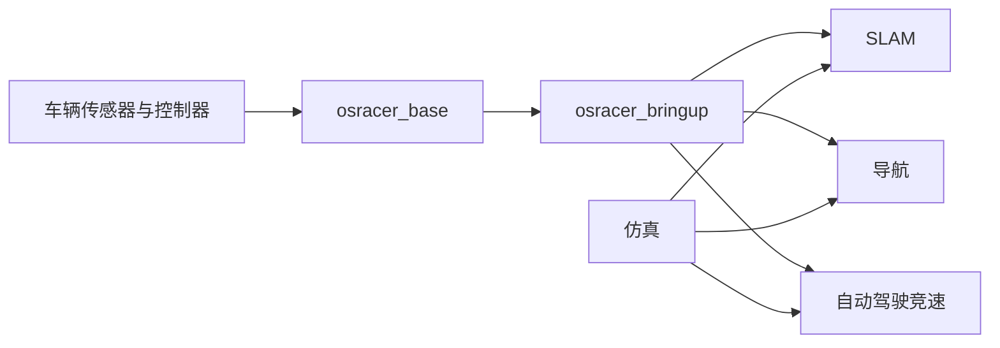

# OSRacer

<!-- markdownlint-disable MD013 MD033 -->

<p align="center">
  <a href="./README.md">English</a> ·
  <a href="./README_zh.md">简体中文</a>
</p>

<p align="center">
  
</p>

<p align="center">
  <strong>面向自动驾驶竞速与移动机器人开发的开源 ROS 2 软件平台。</strong>
</p>

<p align="center">
  <a href="https://github.com/osrbot/osracer/actions/workflows/ros2-static.yml"></a>
  <a href="https://github.com/osrbot/osracer/releases"></a>
  <a href="https://docs.ros.org/en/humble/"></a>
  <a href="https://ubuntu.com/"></a>
  <a href="./LICENSE"></a>
</p>

OSRacer 是 OSRBOT 面向车辆启动、环境感知、建图、导航、自动驾驶竞速、
仿真、标定与诊断开发的 ROS 2 软件平台。项目将真实车辆接入与上层算法开发
组织在同一工作空间内，便于完成从基础调试到可重复自主运行实验的完整流程。

## 主要特点

- **面向 Ackermann 车辆**：提供适用于紧凑型自动驾驶车辆的速度与转向接口。
- **完整机器人运行环境**：统一集成底盘、里程计、惯性测量、激光雷达、相机、
  TF 与状态估计。
- **建图与导航**：提供经过维护的 SLAM 与 Nav2 启动文件和参考配置。
- **自动驾驶竞速**：包含 Follow the Gap、Pure Pursuit、Stanley、MPC、赛线跟踪、
  安全监督与性能评估工具。
- **统一的仿真接口**：运动学仿真与 Gazebo 场景采用和实车一致的 ROS 接口。
- **便于二次开发**：提供按功能划分的配置、标定示例、调试工具与固定版本依赖。

## 最新版本

**OSRacer V1.2** 是当前 ROS 2 平台稳定版本，主要包括：

- 通过固定版本的 OSRacer Base 提供统一 ROS 2 底盘接入；
- 完整的车辆启动、TF、里程计、IMU、激光雷达、相机和状态估计链路；
- 持续维护的 SLAM、Nav2、自动驾驶竞速、仿真、标定与诊断工作流；
- 使用里程计方向主动脱困并清理代价地图的导航恢复行为；
- Base、机器人描述、竞速与仿真之间一致的车辆几何参数；
- 覆盖源码依赖、ROS 构建、功能包测试与安装后 Launch 启动的 CI。

兼容性和升级信息请参阅
[V1.2 版本说明](https://github.com/osrbot/osracer/releases/tag/v1.2.0)。

## 快速开始

### 环境要求

- Ubuntu 22.04
- ROS 2 Humble
- Git、`vcs`、`rosdep` 与 `colcon`
- 实车运行时需要连接 OSRacer 系统

如果尚未安装 ROS 开发工具：

```bash
sudo apt update
sudo apt install python3-colcon-common-extensions python3-rosdep python3-vcstool
```

### 创建工作空间

```bash
mkdir -p ~/osracer_ws/src
cd ~/osracer_ws/src

git clone --recursive https://github.com/osrbot/osracer.git
vcs import . < osracer/osracer.repos

source /opt/ros/humble/setup.bash
rosdep install --from-paths . --ignore-src --rosdistro humble -r -y

cd ~/osracer_ws
colcon build --symlink-install
source install/setup.bash
```

仓库使用固定版本的源码依赖。除非需要升级整个工作空间，否则请保持
`osracer.repos` 导入的 `osracer_base` 版本和 `osracer_dependency`
子模块版本不变。

### 配置串口设备

```bash
ros2 run osracer_base install_udev_rules
```

安装规则后重新连接 USB。如果当前用户刚加入 `dialout` 用户组，请注销后重新登录。

### 启动车辆

```bash
source /opt/ros/humble/setup.bash
source ~/osracer_ws/install/setup.bash
ros2 launch osracer_bringup bringup.launch.py
```

第一次进行运动测试时，应当将驱动轮悬空，并确保能够随时紧急停止车辆。

### 启动功能

车辆启动后，在不同终端执行相应命令：

```bash
# SLAM Toolbox
ros2 launch osracer_slam slam_toolbox.launch.py

# 使用已保存地图和默认控制器启动导航
ros2 launch osracer_navigation nav2.launch.py

# 使用安全配置启动自动驾驶竞速
ros2 launch osracer_race race_bringup.launch.py controller:=gap_follow
```

## 软件架构



`osracer_base` 提供底盘接口，本仓库在其基础上组织整车启动与上层 ROS 应用。
仿真与实车采用一致的控制、里程计、激光扫描和 TF 约定。

## 功能包

| 功能包 | 用途 |
| --- | --- |
| `osracer_bringup` | 车辆、传感器、状态估计、相机、雷达与附件启动 |
| `osracer_description` | 机器人描述、网格模型、TF 与 RViz 资源 |
| `osracer_slam` | SLAM Toolbox、Cartographer、GMapping 与地图工具 |
| `osracer_navigation` | Nav2 启动文件与控制器参考配置 |
| `osracer_race` | 竞速控制器、安全监督、赛线工具与性能评估 |
| `osracer_sim` | 运动学仿真与 Gazebo 工作流 |
| `osracer_calib` | 相机与磁力计标定示例 |
| `osracer_debug` | 传感器、里程计、建图与导航的 RViz/rqt 诊断工具 |
| `osracer_demo` | 现场启动检查与低速演示工具 |

策略开发、Isaac 和 Sim2Real 研究项目位于
[OSRacer Lab](https://github.com/osrbot/osracer_lab)。

### 自动驾驶竞速

推荐先使用 `race_safe.yaml` 完成车辆验证，从 Gap Follow 开始，低速录制赛线，
再比较不同轨迹跟踪控制器。只有完整安全检查通过后，才使用 `race_fast.yaml`。

- [竞速使用指南](osracer_race/README_zh.md)
- [四阶段开发指南](osracer_race/PHASES_zh.md)
- [ROS 与实车验证](osracer_race/ROS_VALIDATION_zh.md)

安装后的验证入口不会发布运动命令：

```bash
bash $(ros2 pkg prefix osracer_race)/share/osracer_race/scripts/validate_race_ros.sh
```

### 开发与运行分工

Jetson Orin Nano 负责运行车辆、传感器、SLAM、导航和竞速节点；开发电脑用于
源码编辑、远程终端、RViz、rosbag 分析以及地图和赛线准备。所有运动相关修改都应
先使用低速安全配置进行实车验证。

## 依赖

| 依赖 | 获取方式 | 用途 |
| --- | --- | --- |
| [`osracer_base`](https://github.com/osrbot/osracer_base) | [`osracer.repos`](osracer.repos) 固定版本 | ROS 2 底盘驱动与车辆接口 |
| [`osracer_dependency`](https://github.com/osrbot/osrbot_dependency) | 固定版本 Git 子模块 | OSRBOT 维护的 ROS 依赖 |
| ROS 软件包 | `package.xml` 与 `rosdep` | 标准消息、驱动、SLAM、导航与可视化组件 |

如果克隆后提示缺少软件包，请恢复仓库声明的源码依赖：

```bash
cd ~/osracer_ws/src/osracer
git submodule update --init --recursive

cd ~/osracer_ws/src
vcs import . < osracer/osracer.repos
```

## 配置

常用配置按照功能组织：

| 内容 | 路径 |
| --- | --- |
| 车辆几何参数与 ROS 限制 | 导入的 `osracer_base` 软件包 |
| 车辆启动与状态估计 | `osracer_bringup/param/` |
| SLAM | `osracer_slam/param/` |
| 导航 | `osracer_navigation/params/` |
| 竞速与赛线 | `osracer_race/config/` |
| 仿真世界 | `osracer_sim/worlds/` |
| 标定 | `osracer_calib/config/` |

配置修改应保持范围清晰。在启用自主运行前，请先验证转向、停止、TF、里程计与
传感器话题。

## 固件更新

固件服务独立于 ROS 工作空间。请使用
[OSR Updater](https://github.com/osrbot/osr_updater) 安装 OSRBOT 针对当前系统
提供的固件文件，不要混用其他交付版本或来源不明的固件。

## 故障处理

| 现象 | 建议处理方式 |
| --- | --- |
| 找不到 `/dev/osrbot_base` | 重新安装 Base udev 规则、连接 USB，并确认当前用户属于 `dialout` 用户组。 |
| 找不到 ROS 软件包 | 初始化子模块、导入 `osracer.repos`、运行 `rosdep`，重新构建并加载工作空间。 |
| 串口被占用 | 停止正在使用底盘串口的其他 ROS 节点或工具，再重新启动。 |
| 传感器话题没有更新 | 检查物理连接，并使用 `ros2 topic hz <topic>` 检查数据频率。 |
| 无法启动导航 | 检查地图路径、`map → odom → base_footprint` TF 链和激光扫描话题。 |
| 固件更新失败 | 停止车辆，保留更新日志和备份文件；传输状态不确定时不要直接重复烧写。 |

请求技术支持时，请一并提供仓库提交、ROS 版本、Jetson/Linux 版本、启动命令和
相关终端输出。

## 版本与支持

- [版本记录](CHANGELOG.md)
- [GitHub Releases](https://github.com/osrbot/osracer/releases)
- [GitHub Issues](https://github.com/osrbot/osracer/issues)
- 技术支持与合作：[winter@osrbot.com](mailto:winter@osrbot.com)

## 作者

- Zhihao ZHANG
- Kit So
- Jintai WANG
- dajianli

## 许可证

OSRacer 使用 [MIT License](LICENSE) 开源。
